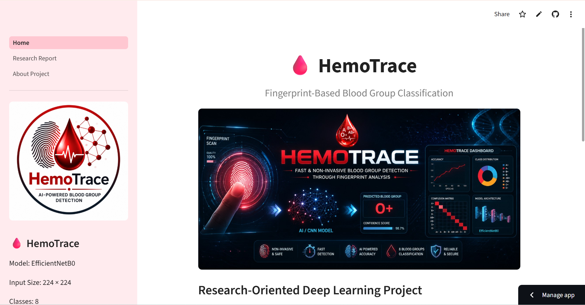
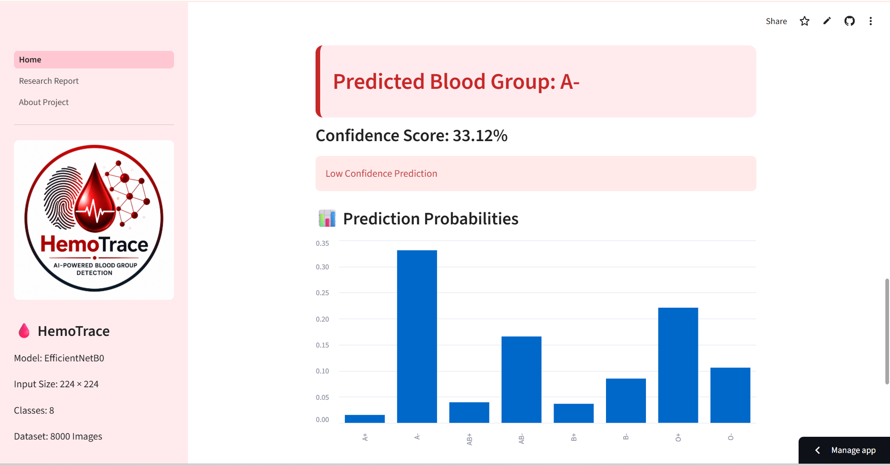
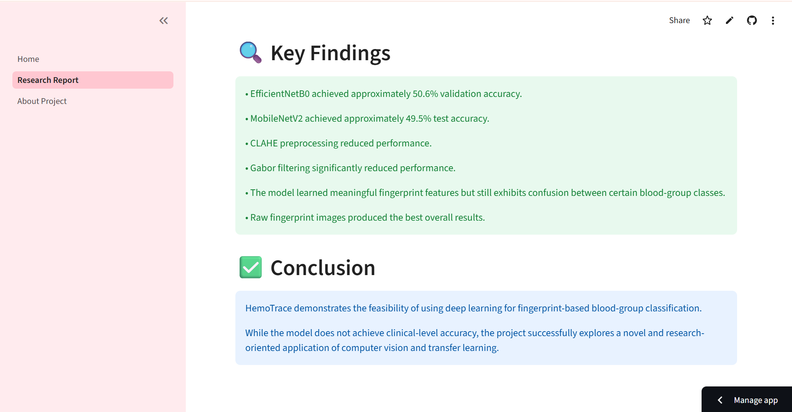

<div align="center">

# 🩸 HemoTrace

### Fingerprint-Based Blood Group Classification using Deep Learning

AI-powered research project exploring whether fingerprint patterns can be used to predict human blood groups using Computer Vision and Transfer Learning.


</div>

---

# 📖 Overview

**HemoTrace** is a research-oriented Deep Learning application that investigates whether **fingerprint images** contain sufficient biometric information to classify an individual's blood group.

The application allows users to upload a fingerprint image and predicts one of eight blood groups using an EfficientNet-based Convolutional Neural Network deployed through a Streamlit interface.

> **Disclaimer:** This project is intended for educational and research purposes only. It is **NOT** a medical diagnostic system.

---

# ✨ Features

- 🩸 Blood Group Prediction from Fingerprints
- 🧠 EfficientNetB0 Transfer Learning Model
- ⚡ TensorFlow Lite Inference
- 📊 Prediction Confidence Scores
- 📈 Probability Distribution Chart
- 🏆 Top 3 Predictions
- 📑 Research Report Page
- ℹ️ About Project Page
- 🖥️ Interactive Streamlit Interface

---

# 🧪 Dataset

| Property | Value |
|----------|-------|
| Total Images | 8000 |
| Classes | 8 Blood Groups |
| Image Size | 224 × 224 |

### Blood Group Classes

- A+
- A-
- AB+
- AB-
- B+
- B-
- O+
- O-

---

# 🧠 Model

**Architecture**

- EfficientNetB0
- Transfer Learning
- TensorFlow / Keras
- TensorFlow Lite Deployment

### Experiments Performed

| Model | Accuracy |
|--------|----------|
| EfficientNetB0 | **50.6%** |
| Fine Tuning | 47.0% |
| CLAHE Preprocessing | 45.5% |
| Gabor Filter | 34.0% |
| MobileNetV2 | 49.5% |
| MobileNetV2 + Grayscale | 48.9% |

---

# 📊 Performance

### Validation Accuracy

**50.6%**

The project also includes:

- Training Accuracy Curve
- Validation Accuracy Curve
- Confusion Matrix
- Prediction Probability Graph

---

# 🏗️ Project Structure

```text
HemoTrace/
│
├── .streamlit/
├── pages/
│   ├── About Project.py
│   └── Research Report.py
│
├── Home.py
├── best_hemotrace.tflite
├── accuracy_curve.png
├── confusion_matrix.png
├── banner.png
├── logo.png
├── requirements.txt
└── README.md
```

---

# ⚙️ Installation

Clone the repository

```bash
git clone https://github.com/Sparsh0227/HemoTrace.git
```

Move into the project

```bash
cd HemoTrace
```

Install dependencies

```bash
pip install -r requirements.txt
```

Run the application

```bash
streamlit run Home.py
```

---

# 🚀 How It Works

1. Upload a fingerprint image (.bmp).
2. Image is resized to **224 × 224**.
3. TensorFlow Lite model performs inference.
4. Predicted blood group is displayed.
5. Confidence score is calculated.
6. Probability chart and Top-3 predictions are shown.

---

# 🖼️ Screenshots

## Home Page

Replace with your screenshot.

```markdown

```

---

## Prediction

```markdown

```

---

## Research Report

```markdown

```

---

# 🛠️ Tech Stack

- Python
- TensorFlow
- TensorFlow Lite
- Streamlit
- NumPy
- Pillow
- Matplotlib

---

# 🔬 Methodology

- Fingerprint Image Collection
- Image Preprocessing
- Transfer Learning
- Model Training
- Validation
- TensorFlow Lite Conversion
- Streamlit Deployment

---

# 📈 Future Improvements

- Larger fingerprint datasets
- Explainable AI (Grad-CAM)
- Improved preprocessing pipeline
- Ensemble Deep Learning models
- Mobile deployment
- Clinical validation

---

# ⚠️ Disclaimer

This application is developed solely for:

- Academic Research
- Educational Purposes
- Computer Vision Demonstration

It must **not** be used for medical diagnosis or healthcare decision-making.

---

# 👨‍💻 Developer

**Sparsh Jain**

GitHub:
https://github.com/Sparsh0227

---

# ⭐ Support

If you found this project useful, consider giving the repository a **Star ⭐**
