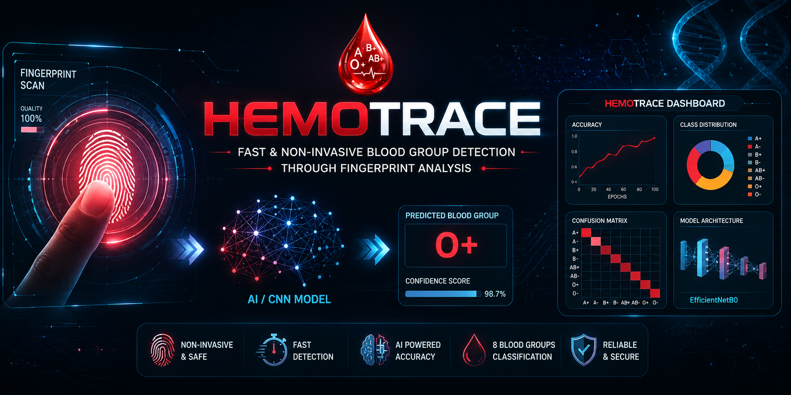
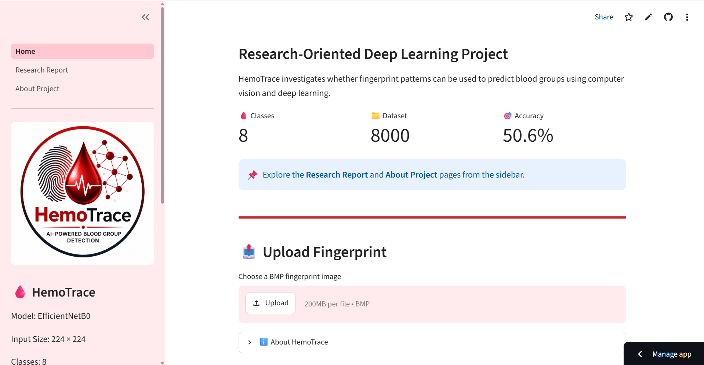
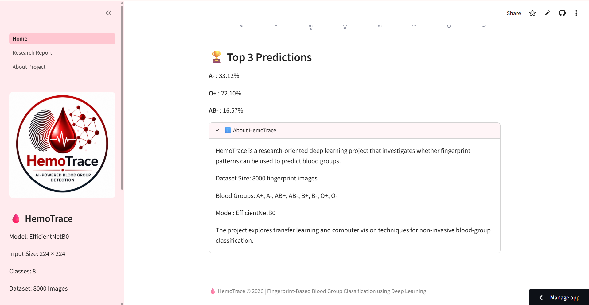
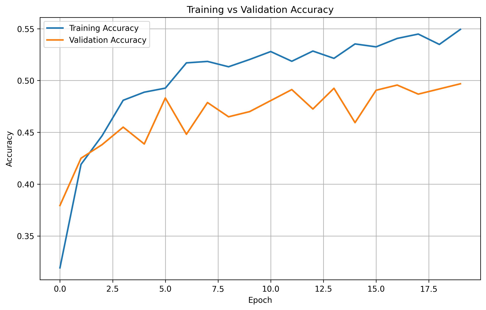
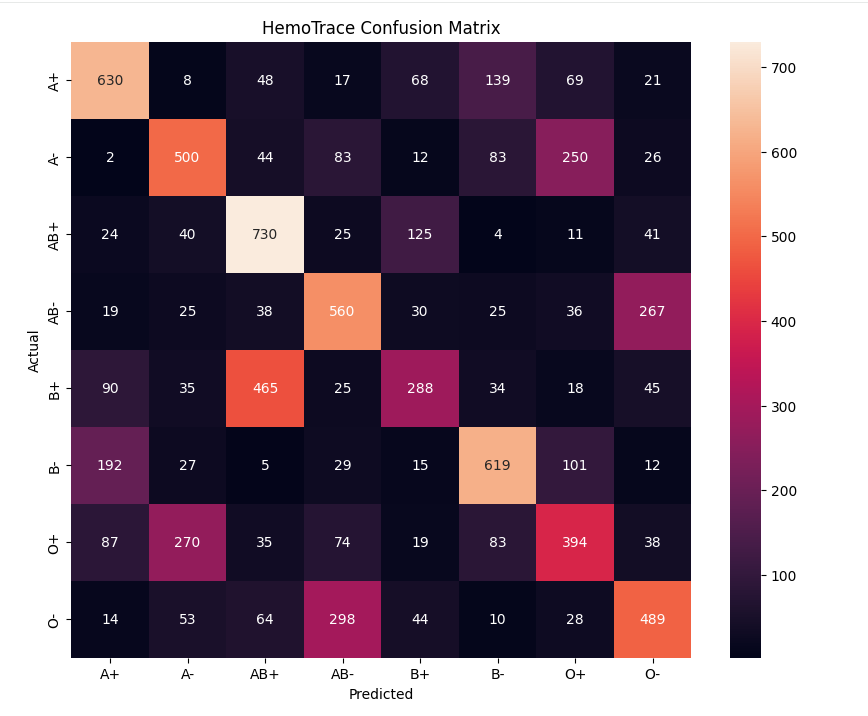
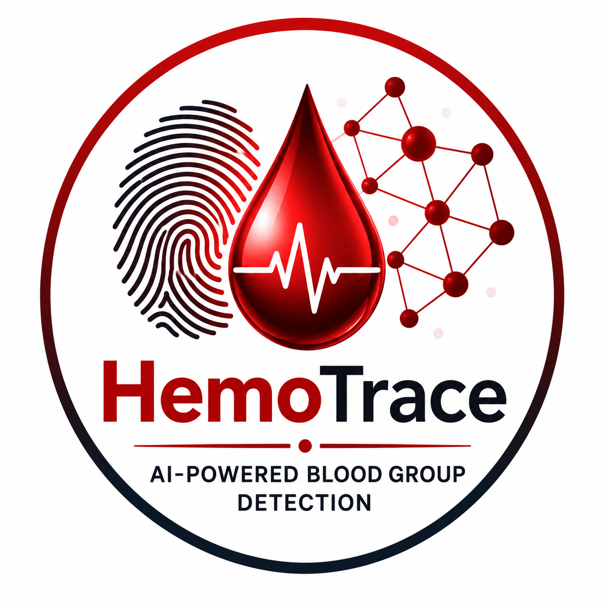

=======

<p align="center">
  
</p>

<div align="center">

# 🩸 HemoTrace

### Fingerprint-Based Blood Group Classification using Deep Learning

AI-powered research project exploring whether fingerprint patterns can be used to predict human blood groups using Computer Vision and Transfer Learning.


<a href="https://hemotrace.streamlit.app/">

</a>

</div>

---

# 🚀 Live Demo

### 🌐 Try HemoTrace Online

👉 **https://hemotrace.streamlit.app/**

---

# 📖 Overview

**HemoTrace** is a research-oriented Deep Learning application that investigates whether **fingerprint patterns contain discriminative features capable of predicting an individual's blood group**.

The project combines **Computer Vision**, **Transfer Learning**, and **TensorFlow Lite** to classify fingerprint images into **eight blood-group categories**. A user-friendly **Streamlit web application** allows users to upload fingerprint images, perform inference in real time, and visualize prediction probabilities.

> ⚠️ **Disclaimer:** This project is intended **only for research and educational purposes** and **must not** be used for medical diagnosis or clinical decision-making.

---

# ✨ Features

- 🩸 Fingerprint-Based Blood Group Prediction
- 🧠 EfficientNetB0 Transfer Learning Model
- ⚡ TensorFlow Lite Optimized Inference
- 📊 Prediction Probability Visualization
- 🎯 Confidence Score Display
- 🏆 Top-3 Blood Group Predictions
- 📑 Interactive Research Report
- 📈 Accuracy Curve & Confusion Matrix
- ℹ️ About Project Page
- 🖥️ Modern Streamlit User Interface

---

# 📸 Application Screenshots

## 🏠 Home Page

The landing page introduces HemoTrace, displays project information, and allows users to upload fingerprint images for prediction.


---

## 📤 Upload Fingerprint

Users can upload fingerprint BMP images which are processed by the trained EfficientNetB0 model.



---

## 🎯 Prediction Result

The application predicts the blood group, displays the confidence score, and visualizes prediction probabilities.


---

## 🏆 Top 3 Predictions

Displays the three most probable blood groups along with their confidence values.



---

## 📑 Research Report

The research report summarizes experiments, evaluation metrics, findings, and conclusions.


---

# 🧪 Dataset

| Property     | Value                |
| ------------ | -------------------- |
| Total Images | **8000**             |
| Classes      | **8 Blood Groups**   |
| Image Size   | **224 × 224 pixels** |

### Blood Group Classes

- A+
- A-
- AB+
- AB-
- B+
- B-
- O+
- O-

---

# 🧠 Model

### Architecture

- EfficientNetB0
- Transfer Learning
- TensorFlow / Keras
- TensorFlow Lite Deployment

---

### Experiments Performed

| Model                   | Validation Accuracy |
| ----------------------- | ------------------- |
| 🥇 EfficientNetB0       | **50.6%**           |
| Fine Tuning             | 47.0%               |
| CLAHE Preprocessing     | 45.5%               |
| Gabor Filter            | 34.0%               |
| MobileNetV2             | 49.5%               |
| MobileNetV2 + Grayscale | 48.9%               |

---

# 📊 Model Performance

## Training vs Validation Accuracy

The EfficientNetB0 model achieved approximately **50.6% validation accuracy** after training.



---

## Confusion Matrix

The confusion matrix illustrates classification performance across all eight blood-group classes.



---

# 🏗️ Project Structure

```text
HemoTrace/
│
├── .streamlit/
├── pages/
│   ├── About Project.py
│   └── Research Report.py
│
├── screenshots/
│   ├── home.png
│   ├── upload.png
│   ├── prediction.png
│   ├── top3.png
│   ├── research.png
│   ├── accuracy_curve.png
│   └── confusion_matrix.png
│
├── Home.py
├── best_hemotrace.tflite
├── banner.png
├── logo.png
├── requirements.txt
├── README.md
└── .gitignore
```

---

# ⚙️ Installation

Clone the repository

```bash
git clone https://github.com/Sparsh0227/HemoTrace.git
```

Move into the project directory

```bash
cd HemoTrace
```

Install dependencies

```bash
pip install -r requirements.txt
```

Run the Streamlit application

```bash
streamlit run Home.py
```

---

# 🚀 How It Works

1. Upload a fingerprint image (`.bmp`).
2. The image is resized to **224 × 224** pixels.
3. The TensorFlow Lite model performs inference.
4. The predicted blood group is displayed.
5. A confidence score is calculated.
6. Prediction probabilities are visualized.
7. The Top-3 predicted blood groups are presented.

---

# 🛠️ Tech Stack

- Python
- TensorFlow
- TensorFlow Lite
- Streamlit
- NumPy
- Pillow
- Matplotlib
- Seaborn
- Scikit-Learn

---

# 🔬 Methodology

- Dataset Collection
- Fingerprint Image Preprocessing
- Image Resizing (224 × 224)
- Transfer Learning using EfficientNetB0
- Model Training
- Validation
- TensorFlow Lite Conversion
- Streamlit Deployment
- Performance Evaluation

---

# 📈 Future Improvements

- Larger and more diverse fingerprint datasets
- Explainable AI using Grad-CAM
- Improved preprocessing techniques
- Hybrid CNN architectures
- Ensemble Learning
- Mobile Application Deployment
- Cloud-based API Integration
- Clinical validation with real-world datasets

---

# ⚠️ Disclaimer

This application has been developed solely for:

- 🎓 Academic Research
- 📚 Educational Purposes
- 🤖 Artificial Intelligence Demonstration

It **must not** be used for medical diagnosis, treatment, or healthcare decision-making.

---

# 👨‍💻 Developer

<p align="center">

</p>

## Sparsh Jain

**AI & Machine Learning Enthusiast**

GitHub: https://github.com/Sparsh0227

---

# ⭐ Support

If you found this project useful, consider giving this repository a **Star ⭐**.

Your support motivates future improvements and research.

---

<div align="center">

### 🩸 HemoTrace

_Fingerprint-Based Blood Group Classification using Deep Learning_

Made with ❤️ using **Python • TensorFlow • Streamlit**

</div>
